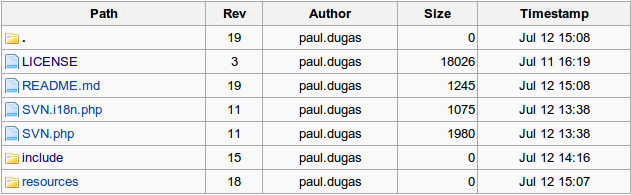

MediaWiki-SVN
=============

MediaWiki Extension for Subversion Integration

MediaWiki-SVN currently a work-in-progress MediaWiki extension that adds
a `<svn/>` tag used to insert links to files in a Subversion repository.

### INSTALLATION

PHP's Subversion extension is needed for this extension.  See http://php.net/manual/en/book.svn.php for details.

No MediaWiki configuration other than including the extension is required.  Add
a line like the one below to the bottom of your `LocalSettings.php` file.

> require_once("$IP/extensions/MediaWiki-SVN/SVN.php");

### USAGE

#### Directory Listing

Use the `<svn>URL</svn>` tag or `{{#svn:URL}}` parser function to insert a tabular 
list of directory entries in/under a given Subversion URL.  

    <svn>https://github.com/pdugas/MediaWiki-SVN/trunk</svn>

or

    {{#svn:https://github.com/pdugas/MediaWiki-SVN/trunk}}

yield a table like this

The links in the `Path` column lead to File Browser pages provided by this extension.  See below.

#### File Info

...

#### File Browser

...

### TODO LIST
* Add . and .. to the directory listing.
* Only publicly accessible repositories accessed via HTTP/HTTPS are currently supported.  Not sure if we want to change that due to potential security risks.
* An error is thrown in the PHP/Apache log when generating a directory listing where the parent directory is the top of the repository.  Want to see if we can head that off some how.

### AUTHORS
* Paul Dugas <paul@dugas.cc>
